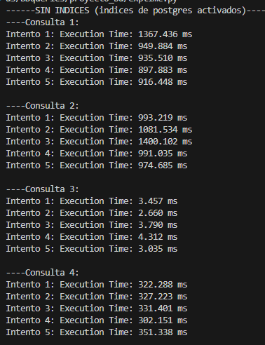
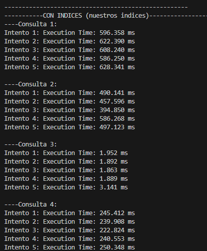

# Proyecto San Benito-Articulos Religiosos
Repositorio del curso de CS-2042 para implementación de base de datos de San benito.

### Archivos

#### creacionTablasBD.sql
En este archivo está el código para crear las tablas, keys, constraints y triggers.

#### consultas.sql
En este archivo está el código con las consultas incluidas y se da una descrición :
-Consulta 1: Total de ventas y cantidad de productos vendidos por cada trabajador en el año 2024.
-Consulta 2: Productos más vendidos durante el año 2024.
-Consulta 3: Cantidad en stock y valor total por despacho y producto.
-Consulta 4: Información de pagos realizados por clientes en el año 2024.

Las consultas que se ejecutarán en los 4 esquemas de 1k,10k,100k,1M.

#### inserciones.sql
En este archivo se realizan las inserciones de las tablas fijas, las cuales fueron los datos recolectados de la empresa:
- Empresa
- Courier
- Comercial
- Trabajador
- Despacho
- Producto

#### indices.sql
Incluye los indices que se utilizarán para la optimización de consultas


####  tablas1k.py
En el archivo tablas1k.py se debe llamar a las funciones para generar la data. Este es el orden en el que se deben de llamar a estas. De igual manera, tenemos configurado el archivo para las tablas de 10k, 100k y 1M de datos.

```python
# Insertar datos fijos
insertar_datos_fijos()
productos = insert_productos_fijos()

#1k
# Generar y poblar tablas
personas = generate_persona(300)
clientes = generate_cliente(200, personas)
repartidores = generate_repartidor(100, [p for p in personas if p not in clientes], [e[0] for e in datos_fijos['empresas'] if e[4] == 'Courier'])
ordenes = generate_orden_de_compra(100, [e[0] for e in datos_fijos['empresas']], [d[0] for d in datos_fijos['despachos']])
comprobantes = generate_comprobante_de_pago(100)
ventas = generate_venta(100, repartidores, personas, comprobantes)
generate_stock(50, productos, [d[0] for d in datos_fijos['despachos']])
generate_abastecimiento(100, productos, ordenes)
generate_item_vendido(100, productos, ventas)
generate_pago(100, ventas, datos_fijos['trabajadores'])
```

#### exptime.py

Este archivo nos ayudó a comparar de manera más rápida los tiempos de ejecuciónen cada consulta, esto nos ayudó a sacar el promedio y la desviación estandar que se muestran en los gráficos del informe. 

Este es el resultado para la prueba sin Indices:



Este es el resultado para la prueba con Indices implementados:

